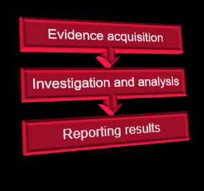
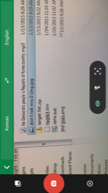
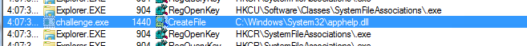
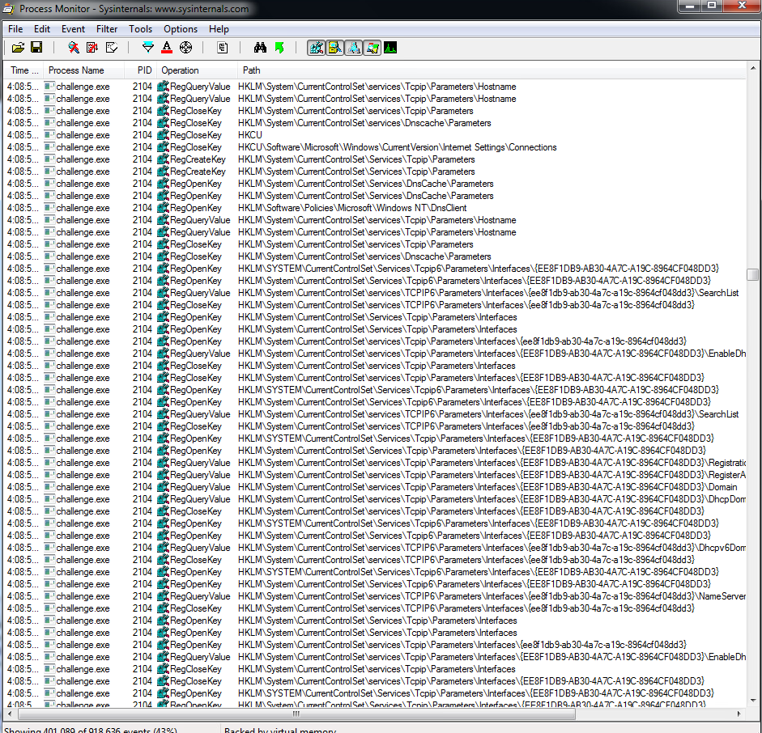
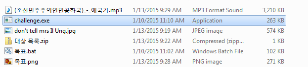
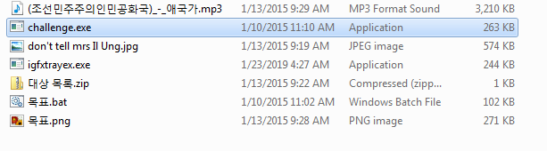
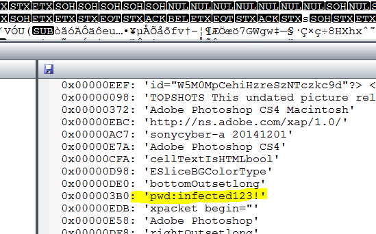
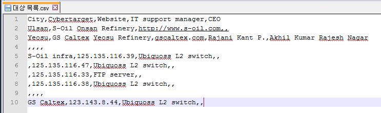
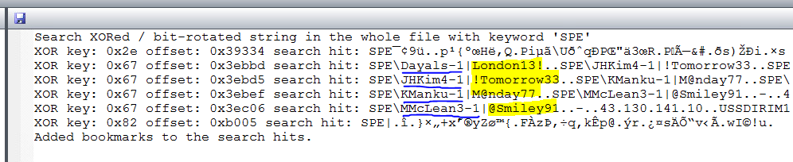

# Week 2 - Advanced Forensics

## Forensics

The 10,000 foot overview is to uncover, investigate and solve digital crimes whether they be from terrorists, state actors, commercial espionage, fraud, theft, etc... This image from this weeks lectures is a very succinct summary of what digital forensics is about. \

Step one is to gather evidence whether it is:
- gaining live access to a target machine
- being given a memory dump
- gaining access to portable media like a hard drive/USB drive/CD/etc...
- server logs
- and others

From there the investigator has to ensure that the evidence is preserved so that their investigation will tamper with the computers/drives in question as little as possible.  Through copies or memory dumps when working with HDDs generally can have very minor effects on the system.  SSDs provide much greater challenges as they have additional memory management firmware built into the drives. The investigation and analysis phase is probably the most technical as the investigator would need to determine:
- if a crime took place
- how it was committed
- was the evidence you gathered used to commit the crime
- building on the last point, how likely was the suspect to have done it

There are so many different tools out there to perform this which is good as there are so many ways to create malware or commit crimes using computers that hopefully there are ways to detect, analyze and ideally prevent it in the future through antivirus definitions and spreading of knowledge with other security researchers and forensic analysts.

The final phase, reporting the results while not the most technical is probably the most important as the report to either law enforcement, a judge, the board of directors at a compromised company, etc...  Because the majority of the people who need the results from the information have no knowledge or training in digital forensics so thorough, easily digestable explanations, detailed logs and journaling are all very important skills for forensics so others can be confident in your work and lawyers for the defense can't poke holes in your analysis as easily.

## Challenge

This was a very cool part of this weeks content because it's a puzzle using real world malware samples.  I've always learned better when working on problems that have applications so this was right up my alley even though I couldn't quite figure out the whole thing.

To start off I used google translate on my phone to see what the korean files meant.  Luckily they were quite descriptive once translated!

From there I decided to run the rootkit to try and figure out what it was doing first.  So I booted up fakenet and process monitor to start diagnosing what the malware was attempting to do. As you can see in the fakenet screenshot it is attempting to call home.

The next 2 images show process monitor where it is creating files such as "apphelp.dll" i'm assuming this is somewhere that the rootkit is hiding so it can reinfect a system if other portions are discovered.  I attempted to do static analysis through file insight however I couldn't find anything that stood out about it in strings/hex/etc... 

Additionally it was nearly continously accessing lots of registry keys and modifying values.  Some of this looks like it was what was setting up the connections to call home to the remote server. 

I couldn't figure out what files were deleted as it didn't seem like any of mine were but that may have been how I setup the malware analysis as everything was running in a separate folder on the desktop.  I did discover that after running another executable was added to the folder as shown in the following before/after pictures.

Before

After

From here I had to reset to my snapshot in order to examine the rest of the files as the malware had made things like windows explorer unstable and need to be restarted multiple times.  I also wasn't sure how else it affected the machine so it seemed like a reasonable thing to do. The first to be discovered was the password for the zip file which was hidden in the strings of the dont tell mrs il ung.jpg as shown below:

Once I unlocked the zip file I found that it contained the target list in a CSV file as shown next:\

From there I carved the drive using photorec to look for hidden files.  Depending how it was done there were either 8 files found or 26 files found.  The most interesting file is the one below showing the signature of the GOP hackers claiming responsibility for the attack.  

Additionally the keyword for an XOR bit rotated string was found using the GOP image.  The keyword turuned out to be "SPE" and it is case sensitive as I tried "spe" first and nearly missed finding it as it came up with different searches with parts of the passwords but not the full username/password combo.

