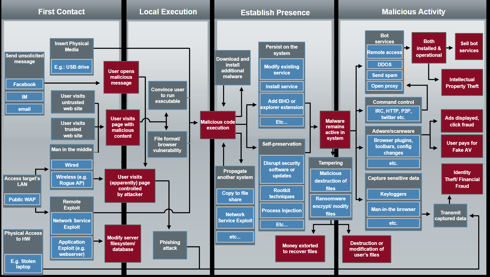

# Week 3 - Malware Defense

## Intro

The first two weeks of the class have been focused on understanding what malware actually is as it can take on many forms from adware, to viruses trying to steal information and then doing digital forensics on malware samples in order to determine what they are trying to infect and how the sample is doing that.

The next logical step is to lay the groundwork for defending against malware. Luckily there are many ways to defend against malware but the best way is a multi-layered approach from user education to antivirus solutions to provide the most coverage and protect against the greatest number of attack vectors.

## Attack Vectors

The very dense graph below shows the main 4 stages of malware delivery, installation and execution.



### First Contact

The first section of the graph relates to how the potential target is first exposed to the malware.  There are a few overall methods with many potential specific ways in each.  The overall methods are:

- Sending a malicious link in an email/instant message/social media post/etc...
- Through physical media like a USB stick, CD or portable hard drive
- By exploiting public wifi 
- Gaining access to the computer in question

### Local Execution

The next section is local execution where after the target has been exposed to the method of delivery for the malwware in most cases the user still needs to actually run the program or open the malicious file in order to actually infect the system and begin delivering the payload.  This is both a good thing and a bad thing as it gives the user one more opportunity to prevent being infected by the malware.  The bad part comes from the fact that the average user knowledge level is low enough to be successfully exploited by malware developers enough to be worth designing malware to exploit.

### Establish Presence

The next phase is the establish presence phase.  This is primarily focused on ensuring the user has a harder time getting rid of the malware and spreading the malicious piece of code to other computers.  The first part of that can be done in a variety of ways.  Some of those being installing additional malware that was either downloaded along with the original piece or by contacting a remote server and downloading more, attempt to modify the system services/registry to hide the files so if some of them are deleted the rest can be re-installed again.  Another part of this can be to change the system task scheduler so the malware will continually try and re-install itself or re-run the payload to infect more machines/harvest data.  Another common strategy is to attempt to disable or delete system antivirus security tools and automatic patching which could potentially stop or remove the malware.  Unfortunately these are just a few of the ways that malware can establish presence in a single machine, network of machines, or throughout a users contacts to remote machines either via email address books, instant messenger contact lists, etc...

### Malicious Activity

The final phase of the attack vector graph is the actual malicious activity.  Everything prior to this has primarily been setup to ensure the malware has been delivered to the target and has spread as far as it can through accessible networks/contacts and finally harden itself against removal so the most damage can be done with the greatest difficulty in removal.  The malicious activity phase itself can be any number of different actions depending on the payload attached to the malware.

- Adware where the user will be served pop ups for products they dont want or that lead to additional malware
- Keylogger in order to capture everything a user types into their keyboard generally searching for usernames and passwords as well as financial information
- Screen grabbers in order to take screenshots of everything the user does on a computer, again generally looking for sensitive data to be sent back to the attacker
- Be added to a botnet so the users computer will be a part of larger DDOS/Spam attacks
- IP theft if corporate espionage is the goal
- Ransomware to lock the users computer down in exchange for a payment to be made for the private key needed to retrieve the data
- Vandalism where files are deleted for any number of reasons

### Summary

While complicated, the attack vector graph is a high level but very thorough look at the steps needed for successfull malware to be interacted with, installed and ran to infect a target machine with a malicious payload.  Ways to mitigate this bring us back to the layered defense strategy which starts with user experience (i.e. don't open suspicious files) and generally progresses to AV software/firewalls.

## YARA

While user experience is the easiest way to defeat a lot of malware it's also nearly impossible to automate and difficult to ensure compliance with.  That brings us to using AV tools that detect malware and either quarantine it and prevent it from running or assist the user in removing from their systems.

So how are these automated systems setup?  Yara is a malware pattern matching software suite specifically designed for examining and creating these rules!  a sample YARA rule pulled from the YARA documentation at https://yara.readthedocs.io/en/v3.4.0/writingrules.html
is as follows: 

```
rule ExampleRule
{
    strings:
        $my_text_string = "text here"
        $my_hex_string = { E2 34 A1 C8 23 FB }

    condition:
        $my_text_string or $my_hex_string
}
```

There are 2 main sections to a yara rule, the first section labeled strings: is how to define the patterns that the rule is attempting to match.  This can be actual strings, hexadecimal strings or regular expressions.  The second section defines the logic of the rule from the variables setup in the strings portion.

## Cuckoo

The other new tool that was introduced this week is cuckoo which from their website https://cuckoosandbox.org bills itself as "the leading open source automated malware analysis system."  It has similar functionality to some of the other malware analysis tools that were introduced in weeks 1 and 2.  It just delivers a filterable CSV file of the results of malicious files/API calls/network traffic/memory analysis that is coupled with YARA.
