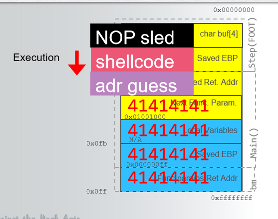

# Week 4 - Vulnerabilities and Exploits

## Intro

This week's material was the opposite side of the coin from what we had been focusing on for the first few weeks of the course.  The previous material was more focused on the blue team side of cybersecurity where you are researching and determining the effects of the malware and possible defenses against them.  This week is much more on the red team side where we were actually exploitiing vulernabilities to run code of our choosing in place of the code that was supposed to be run through internet explorer and activex.

## Zero Day Exploit

Kaspersky labs describes zero day exploits at https://usa.kaspersky.com/resource-center/definitions/zero-day-exploit as "cyber attacks that occur on the same day a weakness is discovered in software." What this means is users/hackers are finding vulernabilities in a given piece of code and either instead of warning the developers of the program the malicious actors exploit the vulnerability for some gain on their part.  Generally they are used to gain program control in order to infect a machine with the payload of their choosing. Additionally zero day exploits can be exploits that hackers find out about when they are discovered by a regular user but they craft and exploit to take advantage of the vulnerability before the developers can address the security flaw with a patch.  These kinds of exploits are extremely dangerous as until the developers are made aware and create a patch for them, anyone running that version of software is at risk.

### Code Execution

1. Crash Triage
2. Determine the return address offset
3. Position our shellcode
4. Find the address of our shellcode

Stack buffer overflows or "Stack Smashes" are caused by overfilling the tbe stack buffer with either particular or random data in order to corrupt the stack and force specific targeted data onto the stack.  This injected malicious code then is executed when the vulnerable program performs a standard return within the code to reposition the EIP register.  This type of is shown from the lecture slides below:



In the specific example above the NOP sled is where a series of non-operations are used to move or slide the memory pointer to the location desired by the hacker in order to facility the exploit.


## Memory Corruption

This week the primary way programs are being exploited through the buffers is actually through memory corruption.  By overflowing or manipulating a stack buffer the hacker is corrupting the memory allocated to the program in order to gain access to either other parts of the system or run code that the original program wasn't planning on running such as en exploit. From the lectures memory corruption can be succintly defined as "Accessing memory in an invalid way which results in an undefined behavior".


### Lab 2

Following the lab directions/hints the first step was to modify the L2 Exercise1  function and trigger the exploit initially.

```
function L2Ecercise1(){
    var s = msfPatternString;
    FSExploitMe.StackBuffer(s)
```

From there WinDbg was used and module byakugan was ran to determine the return address offset like we went over in the code execution portion of the writeup.

```
!load byakugan
!pattern_offset 2000
```

The EIP offset was found to be 1028 which gives the string size to use to point the EIP register at the memory address we are interested in executing our shellcode which is found by finding the jump command in WinDbg as shown below:

```
lmf m FSExploitMe
s 54430000 5443b000 ff e4
```

This address is 54432159.

Next 4 filler bytes were added using \u4141\4141 between the jump and shell code and the exploit was run to launch the calculator through the internet explorer activex vulernability!

## Tools

### WinDBG

The major new tool we went over and used this week is WinDBG which is a debugging and disassembly tool created by microsoft in order to help with the debugging memory dumps/errors/etc... However it can also be used for nefarious purposes as it provides much finer control and access to any program being run on the machine which when used with known exploits can give the ability to modify program behavior in ways it isn't supposed to be done like was shown in the labs for this week.


### Metasploit

Metasploit is a very powerful tool for developing and piecing together exploits with payloads to use against different targets.  Even though the built in exploits/payloads in the free open-source framework edition may not be the most dangerous as they are most likely patched in the majority of systems.  The ability to easily create your own payloads/exploits and execute them through the interface makes it a very powerful tool. The pro version is a paid for edition that provides additional functionality that isn't open source and is locked behind the payment model metasploit has adopted.

### Ida/Ida Pro

Even though we didn't actually use Interactive Disassembler IDA/IDA Pro for this weeks lab it was discussed and mentioned as a very powerful disassembler similar to WinDBG but with additional functionality and a wider set of compilers and instruction sets let a security researcher use just about any set of current or legacy hardware for development/testing.
