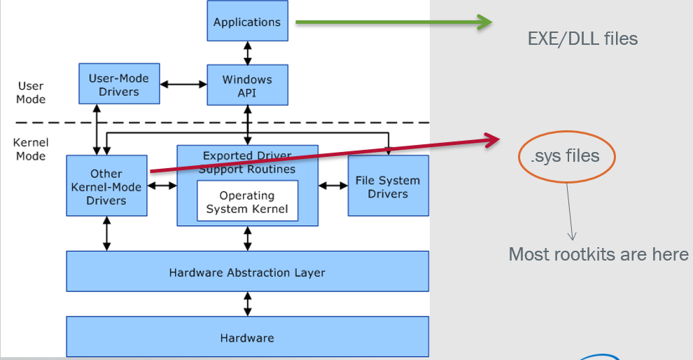
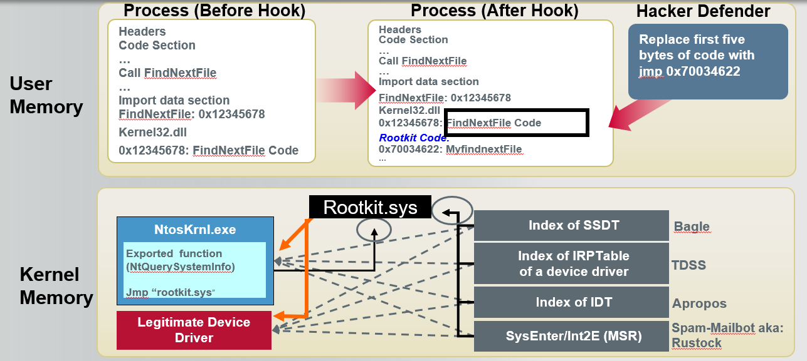

# Week 5 - Windows Internals

## Intro

This week's material was all about going down into the depths of the bowels of windows into the kernel and memory manipulation/management.  I'll be honest this weeks material has been the most difficult for me to wrap my head around as I haven't had any experience working with the kernel.  Trying to understand what all is going on at the lower levels of the machine and learning how even anti-virus providers were not taking tracking/watching for exploits targeting that layer until the mid 2000's put into perspective how complicated the relationship is between the kernel and potential malware that can be hidden there.

## Kernel

As is shown in the image below is a very simplified diagram of the relationship between the hardware/software/kernel layers of a computer.  As is described on https://en.wikipedia.org/wiki/Kernel_(operating_system) the kernel is the nerve center of the operating system with access and authority to control all levels of the system from memory to I/O to passing instructions to the CPU.  Since it is such a critical part of the system it makes an ideal place for hackers to try and inject malware as it can provide access to any part of a system and potentially be extremely difficult to detect and remove.

### Rootkits

The malware that is found on the kernel layer is primarily consists of a type of malware called a "rootkit".  As shown in the previous image, kernel rootkits are generally hidden within the kernel in either driver or system files which make them hard to find.

The real danger from kernel rootkits is their ability to modify the operating system by way of adding, changing or modifying code the operating system code through a process called system hooking.

### Hooking

Symantec defines hooking as https://www.symantec.com/avcenter/reference/windows.rootkit.overview.pdf "whenever an application makes a system call, the execution of that system call follows a predetermined path and a Windows rootkit can hijack the system call at many points along that path."

The above diagram shows the process where the rootkit is being injected after hooking and replacing a few bytes of code with a jmp call to go to another section of memory where the rest exploit is being stored so it can infect the system with whatever the payload is.

### Tools - Tuluka Kernel Inspector

The new tool introduced this week was the Tuluka Kernel Inspector which can detect hidden processes, drivers, hooks, driver signatures, etc...  Additionally it can display kernel memory and dump the kernel drivers and terminate processes.  It is a very versatile and valuable tool when it comes to analyzing rootkits or other malware that has gotten into the kernel layer to determine what they are doing and how they are doing it.
