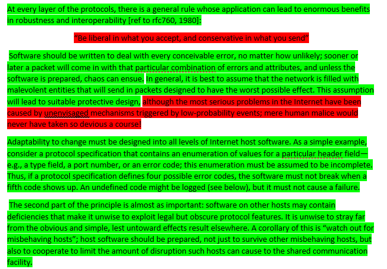

# Week 6 - Windows Internals

## Intro

This week the focus was on network security which as I’ve come to learn is a whole different problem then application or OS security like we have gone over in previous weeks.  The biggest question posed was “Why do we need network security?” When we already have anti-virus software to facilitate malware detection/removal, several main reasons are as follows:
- Prevent unauthorized entry into network 
- Prevent unauthorized removal of data from machines within network
- Protect devices that do not have or cannont install anti-virus/malware protection
- Watch network traffic for suspicious activity

## Robustness Principle

I agree with the vast majority of the robustness principle but in todays day and age I dont think it goes quite far enough in terms of security.  The main quote “Be liberal in what you accept, and conservative in what you send” is great for handling legacy protocols and ensuring all systems can talk to each other while at least trying to promote better practices and protocols by sending only what is required.  In previous decades when the internet was more of an ideal environment this was a perfectly fine solution since the internet is built on trust.  Nowadays with so many nefarious actors and so much of the world being run online as conservative an approach as possible seems to be the most prudent even if it would potentially make things more difficult in terms of communications between devices/networks.  The other portion I highlighted is in the same vein except at the time it was written the author couldn't have known what black hat hackers would think of in terms of exploits and malware that have done extreme finanical, political and industrial damage to governments and companies around the world.

### 
