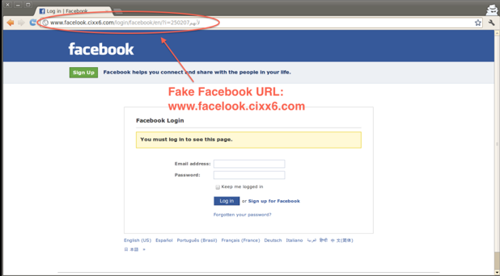
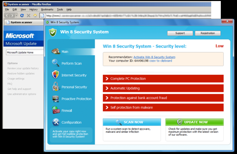

# Week 7 - Web Security

## Intro

This week the focus was on web security which is an extremely important subject as can be seen in the news it seems like most weeks in terms of hacks, breaches and loss of consumer data. Web security encompasses all layers of the internet from the client's browser to the websites and servers of the internet at large. Malware/exploitation has evolved considerably over the last 25 years or so.  In the beginning it was basic phishing in terms of simple email and website scams designed to get people to give up their credit card numbers and popup based malware that tried to trick the user into clicking on something blatant on the screen that would lead them to a malicious site.  Over time more and more sophisticated malware was developed in terms of extremely targeted phishing, zero day browser exploits and web technology exploits like java, flash, HTML5.

## User-Level Attacks

### Social Engineering

The simplest and potentially most difficult form of web vulnerability isn't even a web vulnerability but a human one.  Manipulating someone in order to get enough information about them to compromise a legitimate account or commit some other kind of fraud.

### Phishing

Using fake emails/websites/etc... to fool a victim into putting their info into a fake site that looks like a real one.  A good example can be shown below with a fake facebook page.

### SEO Poisoning

SEO Poisoning is a more complicated technique that involves creating fake or malicious sites and seeding them with trending keywords in order to be ranked highly by search engines like google and bing that way when unsuspecting users search for those terms the fake sites are on the front page and more likely to be clicked on.

### Fake updates & Fake AV

Fake updates and fake AV is a scam that has been around for a long time where either through pop ups that look like real system messages or anti-virus messages.

### WYSIYG

What You See Is What You Get. This uses URL Obfuscation which makes fake URLs look real by using either URL shortening services or alternate letters/numbers like replacing l with I

### Malvertising

Malvertising is another advanced kind of malware where a malicious actor will infiltrate a legitimate ad network with a real ad and once its approved replace it or point it at an ad that contains a malicious payload.

### Waterhole attacks

Waterhole attacks are for targeting specific groups of people by compromising somewhere where they will all gather or get information from like a forum or news group, etc...

### Common Defenses

- Domain Reputation Systems
- Site Certification Services
- Anti-virus
- Safe URL Shorteners
- Customer training
