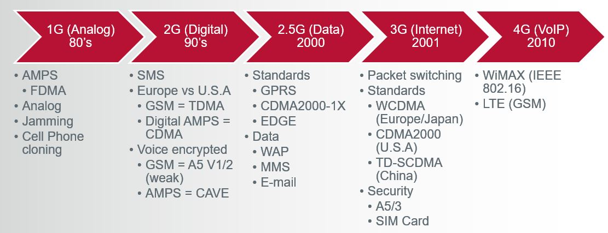

# Week 9 - Mobile Security

## Intro

This weeks discussion was about mobile security specifically android security but we touched on iOS and other mobile operating systems as well as the history of mobile security. The mobile phone industry has exploded not only in terms of size but also in complexity and technology involved.  Once phones started getting "smart" features and full operating systems there were many competing players in the market from Blackberry, Windows, etc... However over the last few years Android and iOS are the only real players left in the smartphone market with android having the lionshare of the market.

## History

Motorola invented the first experimental cell phone back in 1973 and released the first commercially available cell phone in 1984.  These phones ran on the analog cell phone network AMPS also designated as (1G) as it was the first generation cell phone network. 

As shown in the above graph charting the evolution of the cell phone network you can see how and why the complexity of mobile security has gotten vastly more complicated in a few short decades.  Going from analog signals where the worst that could be done was either cloning of phones to steal minutes and make calls on someone else's account or jamming of the signal to prevent mobile phone conversations.  From there once the networks went digital both additional security was added as well as the addition of malware and additional security in the form of encryption and jamming resistance. 

From there the next big leap in mobile networking technology was the inclusion of internet and data which while also brought new security features like encrypted voice and data, additional security hardware like SIM cards and additional encryption, it also allowed the vast majority of the kinds of malware being seen today to be able to be distributed and cause damage/steal information.

## Tools
- APKTool - APKTool is a useful tool that can reverse engineer 3rd party binary android applications. It has the ability to decode and rebuild resources as well as analyzing entry points and XML permissions.
- dex2jar - dex2jar is a group of 4 tools that allow for the reading and writing of Dalvik Executable (.dex) files. The conversion of .dex filess to .jar files. The assembly and disassembly of .dex files to smali files as well as the decryption of strings in .jar files.
- JD-GUI - JD-GUI is a utility that can display the java source code of .class files.  The constructed source code can then be used to gain access to variables and functions of the code.  Very useful for reverse engineering
- Emulator - Emulators are pieces of software that mimic ususally a set of hardware in order to run specific programs.  With relation to this week the emulator in question is an android emulator that can allow a user to simulate and run the android operating system on their computers instead of needing to run it on a mobile device.  This allows for reverse engineering and development to be done on a PC environment.
- AXMLPrinter2 - Converts android binary XML into human readable XML files
- Androguard - Androguard is a set of python tools that allow for the inspection and reverse engineering of android files. This can be done through DEX, ODEX, APK, binary XMLs and android resources by disassembling and decompiling the files.
- JadX - JadX is a .dex file to java decompiler.
